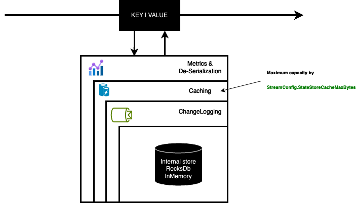

# State stores

⚠️ <span style="color:red">**Some things you need to know**</span> ⚠️

- From 1.4.0 release, the default state store is a RocksDb state store. (Before 1.4.0, the default state store was a in memory state store.)
- RocksDb state store is available from 1.2.0 release.
- By default, a state store is tracked by a changelog topic from 1.2.0 release. (If you don't need, you have to make it explicit).

## Basics

A stateful processor may use one or more state stores. Each task that contains a stateful processor has exclusive access to the state stores in the processor. That means a topology with two state stores and five input partitions will lead to five tasks, and each task will own two state stores resulting in 10 state stores in total for your Kafka Streams application.

State stores in Streamiz are layered in four ways :
- The outermost layer collects metrics about the operations on the state store and serializes and deserializes the records that are written to and read from the state store.
- The next layer caches the records. If a record exists in the cache with the same key as a new record, the cache overwrites the existing record with the new record; otherwise, the cache adds a new entry for the new record. The cache is the primary serving area for lookups. If a lookup can’t find a record with a given key in the cache, it is forwarded to the next layer. If this lookup returns an entry, the entry is added to the cache. If the cache exceeds its configured size during a write, the cache evicts the records that have been least recently used and sends new and overwritten records downstream. The caching layer decreases downstream traffic because no updates are sent downstream unless the cache evicts records or is flushed. The cache’s size is configurable. If it is set to zero, the cache is disabled. (`EARLY ACCESS ONLY`)
- The changelogging layer sends each record updated in the state store to a topic in Kafka—the state’s changelog topic. The changelog topic is a compacted topic that replicates the data in the local state. Changelogging is needed for fault tolerance, as we will explain below.
- The innermost layer updates and reads the local state store.



## In Memory key/value store

As his name, this is an inmemory key value state store which is supplied by InMemoryKeyValueBytesStoreSupplier.
You have an child materialized class to help you to use it.

Usefull with statefull operation like Count, Aggregate, Reduce but also to materialized IKTable<K, V> or IGlobalKTable<K, V>

Example :
``` csharp

builder.Table("test-ktable", InMemory.As<string, string>("test-store"));

builder
        .Stream<string, string>("topic")
        .GroupBy((k, v) => k.ToUpper())
        .Aggregate(
            () => 0L,
            (k, v, agg) => agg + 1,
            InMemory.As<string, long>("agg-store").WithValueSerdes<Int64SerDes>()
        );
```

**Be carefull, this state store is not persistent ! So after each application restart, you loose the state of your state store.**

## In Memory window store

As his name, this is an inmemory windows state store which is supplied by InMemoryWindowStoreSupplier.
You have an child materialized class to help you to use it.

Usefull with windowing statefull operation like Count, Aggregate, Reduce in ITimeWindowedKStream<K, V>

Example :
``` csharp
builder
        .Stream<string, string>("topic")
        .GroupByKey()
        .WindowedBy(TumblingWindowOptions.Of(2000))
        .Aggregate(
            () => 0,
            (k, v, agg) => Math.Max(v.Length, agg),
            InMemoryWindows.As<string, int>("store").WithValueSerdes<Int32SerDes>()
        )
        .ToStream()
        .To<StringTimeWindowedSerDes, Int32SerDes>("output");
```

**Be carefull, this state store is not persistent ! So after each application restart, you loose the state of your state store.**

## RocksDb key/value store

As his name, this is a rocksdb key value state store which is supplied by RocksDbKeyValueBytesStoreSupplier. 

The state store is persisted on disk at `{config.StateDir}/{config.ApplicationId}/{taskId}/rocksdb/{store.Name}`.

You have an child materialized class to help you to use it.

Usefull with statefull operation like Count, Aggregate, Reduce but also to materialized IKTable<K, V> or IGlobalKTable<K, V>

Example :
``` csharp

builder.Table("test-ktable", RocksDb.As<string, string>("test-store"));

 builder
    .Stream<string, string>("topic")
    .GroupBy((k, v) => k.ToUpper())
    .Aggregate(
        () => 0L,
        (k, v, agg) => agg + 1,
        RocksDb.As<string, long>("agg-store").WithValueSerdes<Int64SerDes>()
    );
```

## RocksDb window store

As his name, this is a rocksdb windows state store which is supplied by RocksDbWindowBytesStoreSupplier.

This state store save data in 3 segments, each segment is a rocksdb properly and contains certain time range. This for optimization purposes and for retention periods (window size + grace + window-additional-retention).

You have an child materialized class to help you to use it.

Usefull with windowing statefull operation like Count, Aggregate, Reduce in ITimeWindowedKStream<K, V>

Example :
``` csharp
builder
        .Stream<string, string>("topic")
        .GroupByKey()
        .WindowedBy(TumblingWindowOptions.Of(2000))
        .Aggregate(
            () => 0,
            (k, v, agg) => Math.Max(v.Length, agg),
            RocksDbWindows.As<string, int>("store").WithValueSerdes<Int32SerDes>()
        )
        .ToStream()
        .To<StringTimeWindowedSerDes, Int32SerDes>("output");
```

## Caching

**This feature is available in `EARLY ACCESS` only.**

Streamiz offers robust capabilities for stream processing applications, including efficient data caching mechanisms. Caching optimizes performance by minimizing redundant computations, reducing latency, and enhancing overall throughput within stream processing pipelines.

**Purpose of Caching**

Caching in Streamiz serves several key purposes:
- **Reduction of Redundant Computations**: Stores intermediate results to avoid recomputing data unnecessarily.
- **Performance Optimization**: Minimizes latency by reducing the need for repeated expensive computations or data fetches.
- **Fault Tolerance**: Ensures resilience by maintaining readily accessible intermediate results for recovery during failures.

**Types of Caching**

Streamiz supports one primary type of caching:
1. **State Store Cache**: Enhances processing efficiency by caching state store entries, reducing the overhead of state fetches and updates.

### Configuring Caching
To optimize caching behavior, Streamiz offers configurable parameters:
- **Cache Size**: Defines the maximum size of the cache to balance performance and memory usage. To be fair, this cache size is the maximum cache size per state store. 
- **Enable caching** : By default, caching is disabled for all stateful processors in Streamiz. **This feature will be enabled by default soon.** You can enable the caching feature with `InMemory.WithCachingEnabled()`, `InMemoryWindows.WithCachingEnabled()`, `RocksDb.WithCachingEnabled()` or `RocksDbWindows.WithCachingEnabled()`

``` csharp
// Enable caching for a rocksdb window store
RocksDbWindows.As<string, long>("count-window-store")
        .WithKeySerdes(new StringSerDes())
        .WithValueSerdes(new Int64SerDes())
        .WithCachingEnabled();

// Enable caching for an in-memory window store
InMemoryWindows.As<string, long>("count-window-store")
        .WithKeySerdes(new StringSerDes())
        .WithValueSerdes(new Int64SerDes())
        .WithCachingEnabled();

// Enable caching for an rocksdb key/value store
RocksDb.As<string, long>("count-store")
        .WithKeySerdes(new StringSerDes())
        .WithValueSerdes(new Int64SerDes())
        .WithCachingEnabled();

// Enable caching for an in-memory key/value store
InMemory.As<string, long>("count-store")
        .WithKeySerdes(new StringSerDes())
        .WithValueSerdes(new Int64SerDes())
        .WithCachingEnabled();
```

## Remote storage

Steamiz provides powerful capabilities for real-time stream processing applications, leveraging Kafka as a robust event streaming platform. One of its key features is the ability to manage and store stateful data, crucial for maintaining application state across stream processing operations. While Steamiz offers built-in state stores like RocksDB, In memory store, developers may sometimes need to create custom state stores tailored to specific use cases or integration requirements.

Custom state stores can be beneficial for scenarios such as integrating with existing systems, enhancing performance for specific data access patterns, or ensuring compatibility with proprietary data formats.

### Custom state store 

**Steps to Create Custom State Stores**

1- Implement the State Store

Create a class that extends `IKeyValueStore<Bytes, byte[]>` depending on the nature of your state. This involves defining how the state is stored and accessed. Consider using technologies like in-memory data structures or external databases depending on your use case.

For instance:

``` csharp
public class CustomKeyValueStore : IKeyValueStore<Bytes, byte[]>
{
        /// <summary>
        /// Name of this store
        /// </summary>
        public string Name { get; }

        /// <summary>
        /// Return if the storage is persistent or not.
        /// </summary>
        public bool Persistent { get; }

        /// <summary>
        /// Return if the storage is present locally or not.
        /// If the store is local, an internal kafka topic will be created to offload the data
        /// </summary>
        public bool IsLocally { get; }

        /// <summary>
        /// Is this store open for reading and writing
        /// </summary>
        public bool IsOpen { get; }

        /// <summary>
        /// Constructor with client parameters ..
        /// </summary>
        public CustomKeyValueStore(string uri, string token, string name)
        {
                Name = name;
                // doing something with uri, token etc ..
        }

        /// <summary>
        /// Initializes this state store.
        /// The implementation of this function must register the root store in the context via the
        /// <see cref="ProcessorContext.Register(IStateStore, Internal.StateRestoreCallback)"/> function, where the
        /// first <see cref="IStateStore"/> parameter should always be the passed-in <code>root</code> object, and
        /// the second parameter should be an object of user's implementation
        /// of the <see cref="Internal.StateRestoreCallback"/> interface used for restoring the state store from the changelog.
        /// </summary>
        /// <param name="context">Processor context</param>
        /// <param name="root">Root state (always itself)</param>
        public void Init(ProcessorContext context, IStateStore root)
        {
            throw new NotImplementedException();
        }

        /// <summary>
        /// Flush any cached data
        /// </summary>
        public void Flush()
        {
            throw new NotImplementedException();
        }

        /// <summary>
        /// Close the storage engine.
        /// Note that this function needs to be idempotent since it may be called
        /// several times on the same state store
        /// Users only need to implement this function but should NEVER need to call this api explicitly
        /// as it will be called by the library automatically when necessary
        /// </summary>
        public void Close()
        {
            throw new NotImplementedException();
        }

        /// <summary>
        /// Get the value corresponding to this key.
        /// </summary>
        /// <param name="key">the key to fetch</param>
        /// <returns>The value or null if no value is found.</returns>
        public byte[] Get(Bytes key)
        {
            throw new NotImplementedException();
        }

        /// <summary>
        /// Get an enumerator over a given range of keys. This enumerator must be closed after use.
        /// Order is not guaranteed as bytes lexicographical ordering might not represent key order.
        /// </summary>
        /// <param name="from">The first key that could be in the range, where iteration starts from.</param>
        /// <param name="to">The last key that could be in the range, where iteration ends.</param>
        /// <returns>The enumerator for this range, from smallest to largest bytes.</returns>
        public IKeyValueEnumerator<Bytes, byte[]> Range(Bytes from, Bytes to)
        {
            throw new NotImplementedException();
        }

        /// <summary>
        /// Get a reverser enumerator over a given range of keys. This enumerator must be closed after use.
        /// Order is not guaranteed as bytes lexicographical ordering might not represent key order.
        /// </summary>
        /// <param name="from">The first key that could be in the range, where iteration starts from.</param>
        /// <param name="to">The last key that could be in the range, where iteration ends.</param>
        /// <returns>The reverse enumerator for this range, from smallest to largest bytes.</returns>
        /// <exception cref="InvalidStateStoreException">if the store is not initialized</exception>
        public IKeyValueEnumerator<Bytes, byte[]> ReverseRange(Bytes from, Bytes to)
        {
            throw new NotImplementedException();
        }

        /// <summary>
        /// Return an enumerator over all keys in this store. No ordering guarantees are provided.
        /// </summary>
        /// <returns>An enumerator of all key/value pairs in the store.</returns>
        /// <exception cref="InvalidStateStoreException">if the store is not initialized</exception>
        public IEnumerable<KeyValuePair<Bytes, byte[]>> All()
        {
            throw new NotImplementedException();
        }

        /// <summary>
        /// Return a reverse enumerator over all keys in this store. No ordering guarantees are provided.
        /// </summary>
        /// <returns>A reverse enumerator of all key/value pairs in the store.</returns>
        /// <exception cref="InvalidStateStoreException">if the store is not initialized</exception>
        public IEnumerable<KeyValuePair<Bytes, byte[]>> ReverseAll()
        {
            throw new NotImplementedException();
        }

        /// <summary>
        /// Return an approximate count of key-value mappings in this store.
        /// The count is not guaranteed to be exact in order to accommodate stores
        /// where an exact count is expensive to calculate.
        /// </summary>
        /// <returns>an approximate count of key-value mappings in the store.</returns>
        public long ApproximateNumEntries()
        {
            throw new NotImplementedException();
        }

        /// <summary>
        /// Update the value associated with this key.
        /// </summary>
        /// <param name="key">The key to associate the value to</param>
        /// <param name="value">The value to update, it can be null if the serialized bytes are also null it is interpreted as deletes</param>
        public void Put(Bytes key, byte[] value)
        {
            throw new NotImplementedException();
        }

        /// <summary>
        /// Update the value associated with this key, unless a value is already associated with the key.
        /// </summary>
        /// <param name="key">The key to associate the value to</param>
        /// <param name="value">The value to update, it can be null; if the serialized bytes are also null it is interpreted as deletes</param>
        /// <returns>The old value or null if there is no such key.</returns>
        public byte[] PutIfAbsent(Bytes key, byte[] value)
        {
            throw new NotImplementedException();
        }

        /// <summary>
        /// Update all the given key/value pairs.
        /// </summary>
        /// <param name="entries">A list of entries to put into the store. if the serialized bytes are also null it is interpreted as deletes</param>
        public void PutAll(IEnumerable<KeyValuePair<Bytes, byte[]>> entries)
        {
            throw new NotImplementedException();
        }

        /// <summary>
        /// Delete the value from the store (if there is one).
        /// </summary>
        /// <param name="key">the key</param>
        /// <returns>The old value or null if there is no such key</returns>
        public byte[] Delete(Bytes key)
        {
            throw new NotImplementedException();
        }
}
```

2 - Integrate with Streamiz Application

For using the custom state store within your Streamiz application, you need to write a custom `IKeyValueBytesStoreSupplier`. This supplier will be used to create one or multiple instances of your custom store. Of course, you can add some parameters like URI, API Key/Secret, etc ..

For instance :

``` csharp
    public class CustomStorageSupplier : IKeyValueBytesStoreSupplier
    {
        public String Uri {get;set;}
        public String Token {get;set;}
        public string Name { get; set; }

        public AzureRemoteStorageSupplier(string uri, string token, string name)
        {
            Uri = uri;
            Token = token;
            Name = name;
        }

        public IKeyValueStore<Bytes, byte[]> Get()
            => new CustomKeyValueStore(Uri, Token, Name);

        public string MetricsScope => "custom-remote-storage";
    }
```

3 - Use the supplier

Let's suppose, you would like to materialize a KTable with your custom state store. 

``` csharp
var table = builder.Table("table-input", 
                        Materialized<string, string, IKeyValueStore<Bytes, byte[]>>
                                .Create(new CustomStorageSupplier("uri://", "APIZ?ZLAKZ", "custom-store")));
```

### Azure Table Key/Value store

**This feature is available in `EARLY ACCESS` only.**
 
`1.7.0` introduce a new remote storage. The `Azure Table Store` use under the hood, the Azure Table Client which can be used with a [Table Blob Storage](https://learn.microsoft.com/en-us/azure/storage/tables/table-storage-overview) or a [CosmosDb endpoint](https://learn.microsoft.com/en-us/azure/cosmos-db/table/tutorial-query)

#### How to ?

1- Install this nuget package 

``` 
dotnet add package Streamiz.Kafka.Net.Azure.RemoteStorage
```

2- Use the helper class to materialize the `Azure Remote Store`

``` csharp
var table = builder.Table("table-input", AzureRemoteStorage.As<string, string>());
```

3- Configure it

You can configure the azure endpoint and credentials via two way. 

1- Programmaticaly 
```csharp
var table = builder
                .Table("table-input",
                    AzureRemoteStorage.As<string, string>( 
                            new AzureRemoteStorageOptions
                                {
                                    AccountName = "",
                                    StorageUri = "",
                                    StorageAccountKey = ""
                                }));
```

2- Via Configuration

``` csharp
var config = new StreamConfig<StringSerDes, StringSerDes>{
                ApplicationId = $"test-app",
                BootstrapServers = "localhost:9092"
        };
           
config["azure.remote.storage.uri"] = "URI";
config["azure.remote.storage.account.name"] = "ACCOUNT_NAME";
config["azure.remote.storage.account.key"] = "MASTER_KEY";

/// ....
var table = builder.Table("table-input", AzureRemoteStorage.As<string, string>());
```
