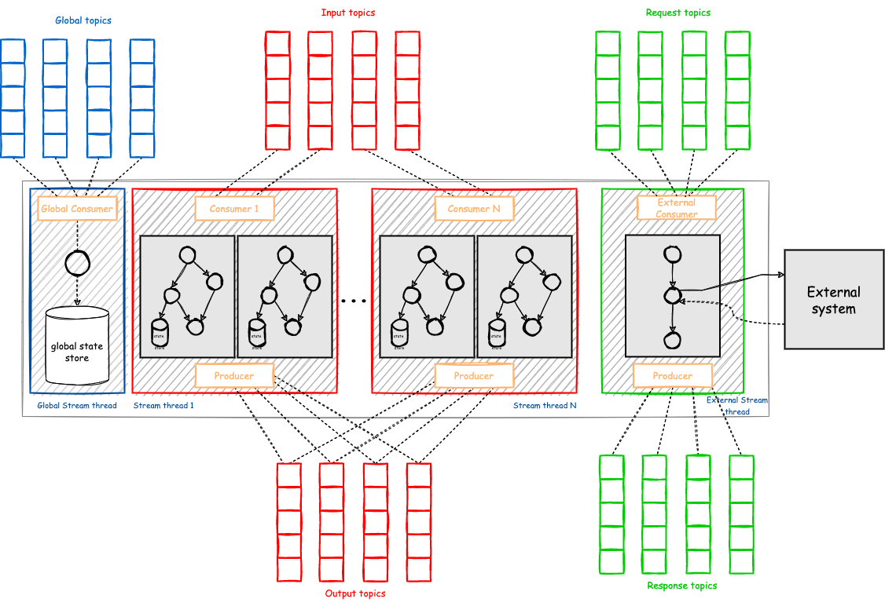
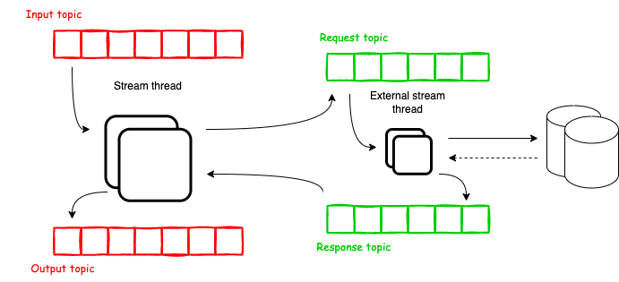

Threading model
=============================================

Streamiz allows the user to configure the number of threads that the library can use to parallelize processing within an application instance.
Each thread can execute one or more stream tasks with their processor topologies independently.

--------------
Stream thread
--------------

The default Streamiz application has one StreamThread.  
Each thread can execute one or more stream tasks with their processor topologies independently.

You configure your number of thread using `config.NumStreamThreads`. 
In contrary JAVA implementation, you can't (for now) adding or removing stream thread when your streamiz application is running.

------------------------------
Global stream thread
------------------------------

This is the thread responsible for keeping all Global State Stores updated. All global state stores are available inside the stream tasks.
The scope of this task is just to read all global topics and update the global state stores.

It is only creating and running if you use `builder.GlobalTable(...)`.

Let's suppose you scale your number instance of your application for 2. 
Their instances have to consumer all partitions both and update two global state store accross all instances.

**How it works ?**

The global consumer `group.id` use is : `{ApplicationId}-Global-{Guid.NewGuid()}`. So each global stream thread has they own `group.id`. 
Because `librdkafka` doesn't not authorize to create a consumer without `group.id` like the kafka consumer JAVA implementation

------------------------------
External stream thread
------------------------------

Calling external system inside your topology can appears some error. First one is if your consumer doesn't fetch messages during `max.poll.interval.ms` (default value : 5 minutes), your consumer will die.

That's why the external stream thread exist. His sole purpose is to execute asynchronous processing from a request topic to a response topic. 

|
In the end, we decoupling the business logic for a call to an external system (Http Rest API, Oracle Db, MongoDb, etc ...). 

You can easily monitor this part regarding the consumer lag from the request topic.

The external stream thread is only running if you use `MapAsync(..)` , `MapValuesAsync(..)`, `FlatMapAsync(..)`, `FlatMapValuesAsync(..)` or `ForEachAsync(..)` inside the definition of your topology. 

For each async processor, a request and a response (except for `ForEachAsync(..)`) topics will be created and the stream thread publish into the request topic and subscribe the response topic. 
